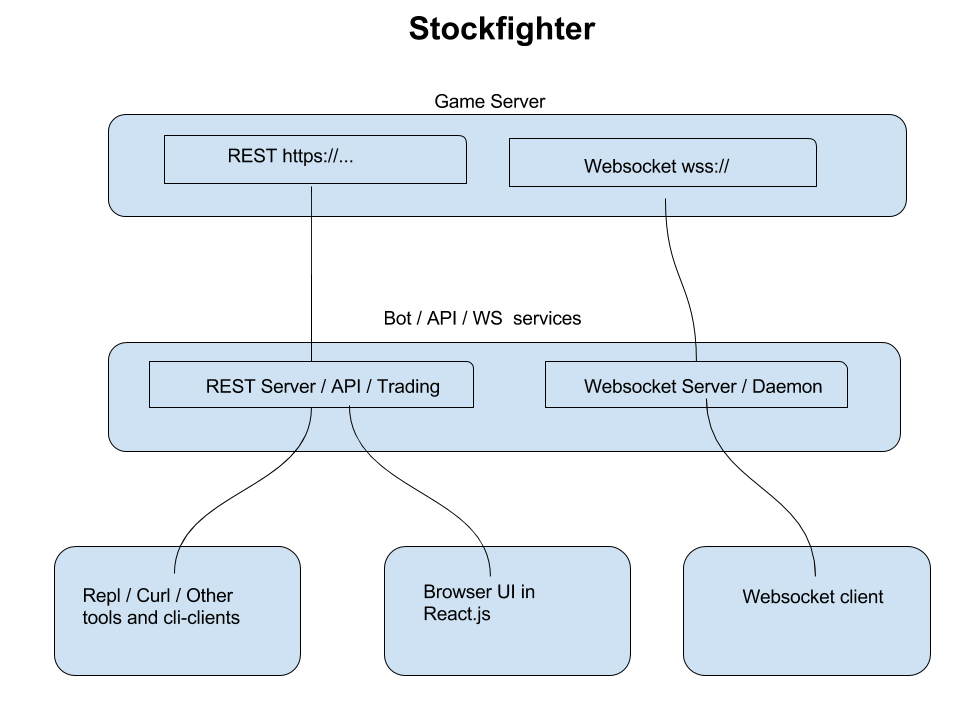

# stockfighter

## It's a video game, except to play you are writing software - or - a bot - to compete in a virtual stock market.  To play, you consume consume REST / Websocket endpoints analyzing the orderbook / market data and trading against it.  There are levels with different objectives.

### It looks like this :

#### RIP stockfighter!   it's dead jim

https://news.ycombinator.com/item?id=10724592

http://www.kalzumeus.com/2015/08/20/designing-and-building-stockfighter-our-programming-game/
